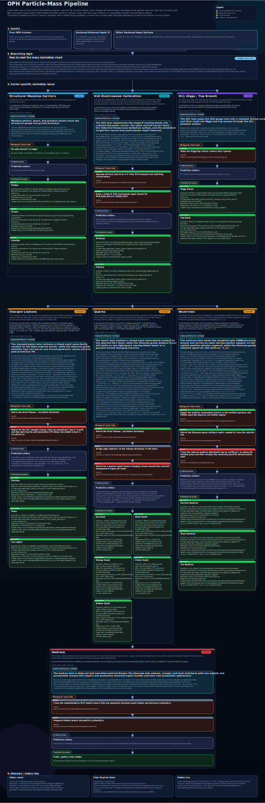

# Observer Patch Holography (OPH)

> L'OPH part d'une idée simple : aucun observateur ne voit le monde entier d'un seul coup. Chaque observateur n'accède qu'à un patch local, et les patchs voisins doivent s'accorder sur leur recouvrement. L'OPH demande quelle part de la physique peut être reconstruite à partir de ce point de départ une fois le ledger complet des axiomes et des branches rendu explicite.

**Version anglaise :** [README.md](README.md)

**Liens rapides :** [site](https://floatingpragma.io/oph/) | [OPH Textbooks](https://learn.floatingpragma.io/) | [OPH Lab](https://oph-lab.floatingpragma.io)

L'OPH est un programme de reconstruction. Espace-temps, structure de jauge, particules, enregistrements et synchronisation des observateurs y apparaissent comme des conséquences du paquet OPH enraciné dans la cohérence de recouvrement sur un écran holographique fini, avec les prémisses de branche explicites énoncées dans les papiers.

## Ce que l'OPH apporte

- Un paquet théorématique à cutoff fixe pour les patches d'observateurs, les collerettes, la réparation de recouvrement, la jauge supérieure, les enregistrements et le checkpoint/restauration.
- Une voie conditionnelle vers la géométrie lorentzienne, le temps modulaire, la dynamique d'Einstein de type Jacobson et la cosmologie de Sitter en patch statique sur le sous-réseau géométrique premier extrait ; la branche d'Einstein utilise la stationnarité à cap fixe, le pont modulaire sur les surfaces nulles et la branche projective séparée sur intervalles bornés, tandis que le scaffold UV/BW restant est la réalisation de la paire de caps géométriques sur ce sous-réseau puis la rigidité des paires de coupures ordonnées, avec le plancher commun éventuel de transport modulaire sur collerette locale fixe comme plus petit bloqueur inférieur.
- Une voie conditionnelle de jauge compacte dans la branche bosonique vers le quotient réalisé du Modèle Standard `SU(3) x SU(2) x U(1) / Z_6`, sous les prémisses de reconstruction par secteurs transportables et sous MAR, avec le réseau exact des hypercharges et la chaîne de comptage réalisée `N_g = 3`, `N_c = 3`.
- Un programme particules avec porteurs structurels exactement sans masse, une branche de calibration électrofaible de Phase II émise vers l'avant avec une surface théorématique publique `W/Z` target-free fermée plus une paire gelée exacte utilisée seulement comme validation compare-only, un étage quantitatif Higgs/top, une fermeture quark exacte sur classe publique sélectionnée avec Yukawas forward exactes explicites, des surfaces exactes non hadroniques et des voies de continuation explicites là où la frontière théorématique reste ouverte.
- Une architecture microphysique d'écran concrète qui met mesure, enregistrements et observateurs à l'intérieur de la physique.

## Surface locale d'unification

L'OPH place une surface locale d'unification autour de l'entrée UV locale calibrée. La même échelle pilotée par `P` porte la voie bosonique électrofaible et Higgs ainsi que la voie entropique gravitationnelle, tandis que la branche lorentzienne fournit la vitesse causale invariante et que le paquet local de lecture fournit l'affichage SI.
Sur la surface publique des constantes, `hbar` et `k_B` restent dans cette couche aval de lecture en unités familières plutôt que d'apparaître comme des constantes OPH émises de manière autonome.

  

Les constantes, chaînes de théorèmes et fronts de preuve ouverts pour cette surface sont suivis dans [extra/OPH_PHYSICS_CONSTANTS.md](extra/OPH_PHYSICS_CONSTANTS.md).

**Pile générale des théorèmes et dérivations**

  

La pile OPH complète, des axiomes jusqu'à la relativité, la structure de jauge, les particules, les observateurs et les fronts encore ouverts. Cliquez pour ouvrir le SVG complet.

## Dérivations précises

Ce tableau se concentre sur les sorties OPH pour lesquelles il existe une comparaison numérique
directe avec la dernière valeur officielle PDG ou NIST. Les résultats structurels comme la branche
lorentzienne `3+1D`, le quotient de jauge du Modèle Standard `SU(3) x SU(2) x U(1) / Z_6`, le
réseau exact des hypercharges et la chaîne de comptage `N_g = 3`, `N_c = 3` sont énoncés dans les
papiers et ne sont pas répétés ici.

| Constante ou particule | Abréviation standard | Valeur prédite par OPH | Dernière valeur PDG / NIST | Accord | Source de mesure |
| --- | --- | --- | --- | --- | --- |
| Constante de gravitation newtonienne | `G` | `6.674299995910528 x 10^-11 m^3 kg^-1 s^-2` | `6.67430(15) x 10^-11 m^3 kg^-1 s^-2` | `0.00003σ` | [NIST 2022](https://physics.nist.gov/cuu/pdf/wall_2022.pdf) |
| Vitesse de la lumière dans le vide | `c` | `299792458 m s^-1` | `299792458 m s^-1 (exact)` | `100% match` | [NIST 2022](https://physics.nist.gov/cuu/pdf/wall_2022.pdf) |
| Inverse de la constante de structure fine | `alpha^-1(0)` | `137.035999177` | `137.035999177(21)` | `100% match` | [NIST 2022](https://physics.nist.gov/cgi-bin/cuu/Value?eqalphinv=) |
| Masse du photon | `m_gamma` | `0 eV` | `< 1 x 10^-18 eV` | `Sous la borne PDG` | [PDG 2025 jauge/Higgs](https://pdg.lbl.gov/2025/tables/rpp2025-sum-gauge-higgs-bosons.pdf) |
| Masse du gluon | `m_gluon` | `0 GeV` | `0 GeV` | `100% match` | [PDG 2025 jauge/Higgs](https://pdg.lbl.gov/2025/tables/rpp2025-sum-gauge-higgs-bosons.pdf) |
| Masse du graviton | `m_graviton` | `0 eV` | `< 1.76 x 10^-23 eV` | `Sous la borne PDG` | [PDG 2025 jauge/Higgs](https://pdg.lbl.gov/2025/tables/rpp2025-sum-gauge-higgs-bosons.pdf) |
| Masse du boson W | `m_W` | `80.377000015 GeV` | `80.3692 ± 0.0133 GeV` | `0.59σ` | [PDG 2025 jauge/Higgs](https://pdg.lbl.gov/2025/tables/rpp2025-sum-gauge-higgs-bosons.pdf) |
| Masse du boson Z | `m_Z` | `91.187978078 GeV` | `91.1880 ± 0.0020 GeV` | `0.01σ` | [PDG 2025 jauge/Higgs](https://pdg.lbl.gov/2025/tables/rpp2025-sum-gauge-higgs-bosons.pdf) |
| Masse du boson de Higgs | `m_H` | `125.218922060 GeV` | `125.20 ± 0.11 GeV` | `0.17σ` | [PDG 2025 jauge/Higgs](https://pdg.lbl.gov/2025/tables/rpp2025-sum-gauge-higgs-bosons.pdf) |
| Masse du quark top | `m_t` | `172.388645595 GeV` | `172.56 ± 0.31 GeV` | `0.55σ` | [PDG 2025 quarks](https://pdg.lbl.gov/2025/tables/rpp2025-sum-quarks.pdf) |
| Masse du quark bottom | `m_b(m_b)` | `4.183 GeV` | `4.183 ± 0.007 GeV` | `100% match` | [PDG 2025 quarks](https://pdg.lbl.gov/2025/tables/rpp2025-sum-quarks.pdf) |
| Masse du quark charm | `m_c(m_c)` | `1.273 GeV` | `1.2730 ± 0.0046 GeV` | `100% match` | [PDG 2025 quarks](https://pdg.lbl.gov/2025/tables/rpp2025-sum-quarks.pdf) |
| Masse du quark étrange | `m_s(2 GeV)` | `93.5 MeV` | `93.5 ± 0.8 MeV` | `100% match` | [PDG 2025 quarks](https://pdg.lbl.gov/2025/tables/rpp2025-sum-quarks.pdf) |
| Masse du quark down | `m_d(2 GeV)` | `4.70 MeV` | `4.70 ± 0.07 MeV` | `100% match` | [PDG 2025 quarks](https://pdg.lbl.gov/2025/tables/rpp2025-sum-quarks.pdf) |
| Masse du quark up | `m_u(2 GeV)` | `2.16 MeV` | `2.16 ± 0.07 MeV` | `100% match` | [PDG 2025 quarks](https://pdg.lbl.gov/2025/tables/rpp2025-sum-quarks.pdf) |

L'accord est donné en nombre de sigma lorsque le PDG ou le NIST publie une incertitude à un sigma.
Pour les définitions exactes, les égalités exactes aux chiffres affichés ou les bornes supérieures
publiées, le tableau affiche `100% match` ou `Sous la borne PDG`.

Pour les quarks, le PDG utilise ses conventions standard : `u`, `d` et `s` à `2 GeV`, `c` et `b`
dans le schéma `MS` à leur propre échelle de masse, et le résumé de masse directe du top pour `t`.
Les papiers contiennent aussi les dérivations structurelles du Modèle Standard listées plus haut
ainsi qu'une famille neutrino de rang théorème, qui n'apparaissent pas dans ce tableau faute de
ligne de comparaison PDG/NIST directe à un seul nombre.

**Pile de dérivation des particules**

  

Vue compacte de la voie particules. Cliquez pour ouvrir le SVG complet.

## Articles

- **Papier 1. [Observers Are All You Need](paper/observers_are_all_you_need.pdf)** : papier de synthèse de l'ensemble OPH.
- **Papier 2. [Recovering Relativity and the Standard Model from the OPH Package Rooted in Observer Consistency](paper/recovering_relativity_and_standard_model_structure_from_observer_overlap_consistency_compact.pdf)** : papier de dérivation relativité/structure du Modèle Standard.
- **Papier 3. [Deriving the Particle Zoo from Observer Consistency](paper/deriving_the_particle_zoo_from_observer_consistency.pdf)** : dérivation des particules, surface exacte, et carte des frontières théorématiques.
- **Papier 4. [Reality as a Consensus Protocol](paper/reality_as_consensus_protocol.pdf)** : formulation point fixe, réparation, et consensus.
- **Papier 5. [Screen Microphysics and Observer Synchronization](paper/screen_microphysics_and_observer_synchronization.pdf)** : architecture d'écran finie, enregistrements, et machinerie observateur.

## Plus

- **Site officiel :** [floatingpragma.io/oph](https://floatingpragma.io/oph)
- **Page theory of everything :** [floatingpragma.io/oph/theory-of-everything](https://floatingpragma.io/oph/theory-of-everything)
- **Page simulation theory :** [floatingpragma.io/oph/simulation-theory](https://floatingpragma.io/oph/simulation-theory/)
- **Livre :** [oph-book.floatingpragma.io](https://oph-book.floatingpragma.io)
- **Application d'étude guidée :** [learn.floatingpragma.io](https://learn.floatingpragma.io/)
- **Questions et explications détaillées :** OPH Sage sur [Telegram](https://t.me/HoloObserverBot), [X](https://x.com/OphSage) ou [Bluesky](https://bsky.app/profile/ophsage.bsky.social)
- **Lab :** [oph-lab.floatingpragma.io](https://oph-lab.floatingpragma.io)
- **Objections courantes :** [extra/COMMON_OBJECTIONS.md](extra/COMMON_OBJECTIONS.md)
- **Note IBM Quantum :** [extra/IBM_QUANTUM_CLOUD.md](extra/IBM_QUANTUM_CLOUD.md)

## Guide du dépôt

- **[`paper/`](paper)** : PDF, sources LaTeX et métadonnées de release.
- **[`book/`](book)** : source du livre OPH.
- **[`code/`](code)** : sorties calculatoires, surface particules et expériences.
- **[`assets/`](assets)** : schémas et figures publics.
- **[`extra/`](extra)** : notes publiques maintenues, objections, comptes rendus expérimentaux et quelques essais de support.
